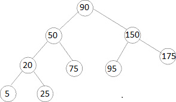

# Tree

[Back to welcome](welcome.md)

## What is a Tree?
A Tree is a **non-linear** data structure. What this means is that the
data inserted in the tree doesn't have to be ordered sequentially. When
we have a list, or a set, or a stack we can go through every item inside
of it in a single run. With a Tree, this may not be possible and will
frequently use recursion to treverse the Tree.

*example:* Lets imagine an apple tree (yes a physical tree). You are 
asked to pick all the apples from this tree starting at the base of the
tree, or the **root**. After climbing to the first branch you see an 
you see an apple so you start following the branch (lets call this a 
**subtree**). After picking an apple from it's **leaf** You will follow
the subtree backwards and either follow a different path from the branch 
to a new leaf, or you will go back to the root and find a new subtree.

## How a tree works
A tree is similar to a linked list by using nodes that are connected 
together by pointers. However, a tree is not limited to only one node. 
A great example is the binary tree which can have at most 2 nodes 
branching off of one node. The start of the binary tree is the root 
and there can only ever be one root. That root can produce up to two 
nodes coming off of it, these are refered to as **child** nodes. If 
these nodes in turn branch off into more nodes, then that child is now
a subtree and also a **parent** because it has new nodes branching off.
Only when we reach a node that doesn't have any childern do we call it
a leaf. 



## Why do trees matter
To answer this question lets talk about the binary search tree. It has 
all of the characteristics of a binary tree, but a binary search tree is 
organized. If we have the numbers 1-10 and the root is 5 then we will 
have the higher numbers branch off in one direction and the lower numbers
branch off into a different direction, then we will create new subtrees to
further divide the elements until each node has a single value. In terms of
efficiency, we are looking at Olog(n) because our list of possibilities is 
reduced by half with each child we follow.

# Example
Lets look at inserting values into a tree. First lets define a tree class
and a class for the Nodes.

``` Python
class BST:
    class Node:
        def __init__(self, data):
            self.left = None
            self.right = None
            self.data = data

    def __init__(self):
        self.root = None
    
    def insert(self, data):
        if self.root is None:
            self.root = BST.Node(data)
        else:
            self._insert(data, self.root)
```

Now we have our classes and our inits for those classes. We also have a 
wrapper function for our insert. It doesn't do much by itself, but will
fill out as we include the rest of the logic to the _insert function.


``` Python
    def _insert(self, root, data):
        if data < node.data:
            # The data belongs on the left side.
            if node.left is None:
                # We found an empty spot
                node.left = BST.Node(data)
            else:
                # Need to keep looking.  Call _insert
                # recursively on the left sub-tree.
                self._insert(data, node.left)
        else:
            # The data belongs on the right side.
            if node.right is None:
                # We found an empty spot
                node.right = BST.Node(data)
            else:
                # Need to keep looking.  Call _insert
                # recursively on the right sub-tree.
                self._insert(data, node.right)
```

Lets step through the logic of the _insert function. First thing we check
is if the data we are trying to put in is less then the current node. If
so, then we will go left. If there isn't a node on the left hand side, then
we will add in our new data. If there is another node, then we will use
recurrsion to call our own function again, to see if we need to go left or
right of this new node.

# Pitfalls
Lets show one possible pitfall with our current methods. If I tried to do
these inserts in this order, there will be a strange result

insert(10)
insert(15)
insert(11)
insert(13)
insert(14)

Our result would look something like this:
        |10|
           |15|
        |11|
           |13|
              |14|

The reason our tree looks funky is because it doesn't currently have a sort
function. Each time insert is called, it will look at the node to the left
and right of the current one, then keep going down the tree no matter the 
current structure to the tree. Try steping through the logic one insert
statement at a time and you will begin to understand. This is not a binary
search tree and won't become one unless it is sorted.

Another limitation to trees in general is that you will have to travel 
through the tree each time you would like access to a single node. While
the efficiency is usually great, it starts to decline if it has to be called
constantly. 

# Positives
Trees can be great when the data naturally forms a heirarchy, such as folders
in a computer. Also if the data is organized correctly, it is very fast at 
retriving and removing data.


# Problem
I have a binary search tree and would like to see how far down it goes, or
what the max amount of steps I will need to take to retrieve a node from 
this tree. Recursion will be used here to test out each possibility. Start
with this code.

``` Python
class Node:
    def __init__(self, data):
        self.left = None
        self.right = None
        self.data = data
 
def max(root):
    pass
```

[solution](tree.py)